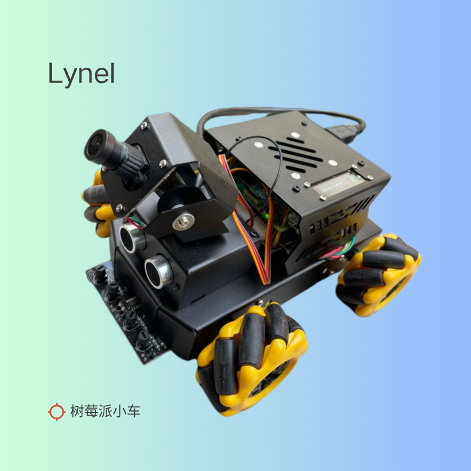

# Lynel 4WD Robot

## 简介

Lynel 4WD Robot 是一个四轮驱动机器人，使用 Raspberry Pi 作为主控，通过 I2C 协议与电机驱动板通信。取名叫 Lynel 是因为希望它能像《塞尔达传说》里的人马老师一样，速度快，反应灵敏，能快速移动。这部小车基于 Yahboom 公司的智能小车改的，原来的驱动是用 Python 写的，把这部分用 Rust 重写，希望能提高运行速度。

## 硬件

- Raspberry Pi 5
- 电机驱动板
- 电池
- 轮子
- 底盘

